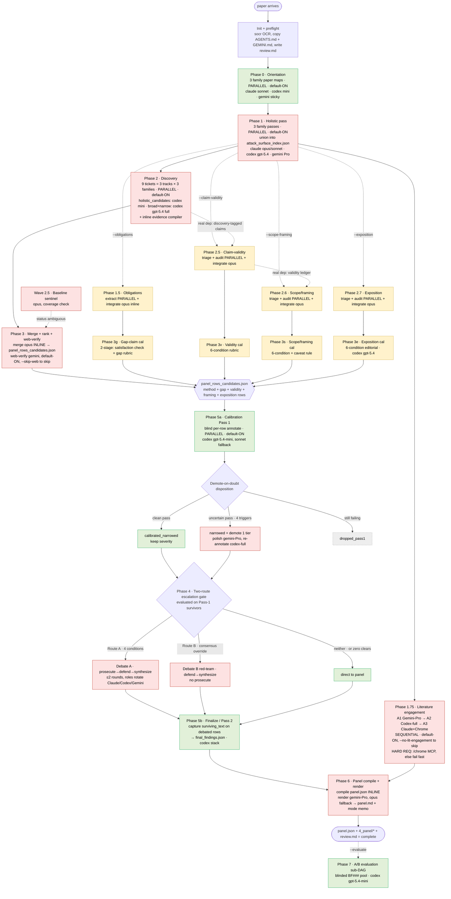

# Disputatio end-to-end pipeline map

*Canonical process diagram: what happens from the moment a paper arrives until the final panel is rendered. Reconciled from `SKILL.md` (authoritative) with a Codex + Gemini panel review (consilium, 2026-06-17). Where `SKILL.md` contradicts itself, this map shows the **dependency-correct** flow and lists the drift in the "Known spec drift" section below — fix `SKILL.md`, then this map.*

**Why this exists:** it is the substrate for the refine.ink benchmark + cost-optimization work (issue #53). Node colour = model tier: 🔴 **frontier / judgment** (cost targets, must stay big) vs 🟢 **mechanical / rubric-bounded** (cheap-able with small/local models) vs 🟡 **opt-in audit track**.

## Control-flow DAG

## Execution order + dependencies

| Phase | Parallelism | Default / flag | Consumes | Emits |
|---|---|---|---|---|
| 0 Orientation | 3 families ∥ | ON | `_paper/paper.md` | `orient_<agent>.json` |
| 1 Holistic | 3 families ∥, then inline union | ON | paper + own orient | `holistic_<agent>.json`, `attack_surface_index.json` |
| 1.5 Obligations | extract ∥, integrate inline | **opt-in `--obligations`** | paper, families | `obligation_{ledger,queue}.json` |
| 1.75 Lit engagement | A1→A2→A3 sequential | ON, `--no-lit-engagement`; **needs /chrome** | paper, Claude orient/holistic, attack index | `literature_engagement.json` |
| 2 Discovery | 9 tickets ∥ | ON | paper, own orient/holistic, attack index, lit context | `discover_<agent>_<track>.json` |
| 2.5 Claim-validity | triage/audit ∥, integrate inline | **opt-in `--claim-validity`** | holistic claims, obligation ledger, **+ discovery-tagged findings** | `claim_validity_{ledger,queue}.json` |
| 2.6 Scope/framing | triage/audit ∥, integrate inline | **opt-in `--scope-framing`** | narrative surfaces, **+ obligation ledger, + validity ledger** | `scope_framing_{ledger,queue}.json` |
| 2.7 Exposition | triage/audit ∥, integrate inline | **opt-in `--exposition`** | paper, own orient/holistic | `exposition_{ledger,queue}.json` |
| 3 Merge + verify | merge inline, verify 1 ticket | ON; verify `--skip-web` | 9 discovery files (+ baseline) | `panel_rows_candidates.json` |
| 3g/3v/3s/3e Calibrators | independent sub-DAGs, entries ∥ | run iff source queue exists | source queue + paper + candidates | typed rows → merged before 5a |
| 5a Calibration Pass 1 | 1 ticket/row, concurrent 4 | ON | candidate pool | annotated rows, drops, rewrites |
| 4 Gate + debate | gate inline; debates ∥ across issues, sequential within | ON; debate only for gate-clearers | Pass-1 survivors | gate decisions, debate outputs, drops |
| 5b Finalize / Pass 2 | per debate survivor | ON | direct rows + debate survivors | `final_findings.json` |
| 6 Panel + render | compile inline, 1 render ticket | ON; `--mode author\|referee` | final findings, paper, engine, holistic, lit + v8 rows | `panel.json`, `panel.md`, mode memo |
| 7 A/B evaluation | 1 ticket/blinded finding | **opt-in `--evaluate`** | final findings or cross-version pool | `_evaluation/results.json` |

**Non-obvious ordering (both panelists confirm):** calibration **Pass 1 (5a) runs BEFORE the Phase 4 gate**; **Pass 2 (5b) runs AFTER debate**. The gate's Condition 4 reads the *Pass-1* verdict, which is why 5a must precede it.

## Decision-condition table

| Gate | Exact condition | True → | False → |
|---|---|---|---|
| Lit preflight (1.75) | enabled AND `/chrome` connected | run A1→A2→A3 | `--no-lit-engagement`: skip · missing chrome: **fail fast** |
| Narrow-evidence audit (2) | every theory/proof surface has M8 finding or clean_trace; surfaces covered | accept | retry once, then log + continue |
| Category fallback (2) | `other` > 10% of one ticket's output | log warning, continue | normal |
| Web-verify (3) | not `--skip-web` AND rows have `needs_web_verification:true` | gemini web evidence, no drop/rerank | use candidates directly |
| 3g satisfaction fires | `integrated_status` split/partial OR any family `satisfied: yes\|partial` | check cited `found_at` | `unanimous_unsatisfied` → straight to gap rubric |
| 3g satisfaction result | `yes` → drop `resolved_satisfied` | — | `partial`/`no` continue · `indeterminate` drop |
| 3g gap rubric | burden + obligation + scoped-absence + substitute + consequence ALL hold | emit `claim_type: gap` | resolved/inadequate/indeterminate/not_a_gap |
| 3v validity | all 6 conditions pass | emit `claim_type: validity` | drop |
| 3s scope/framing | components 1–4 + 6 pass (5 modulates severity) | emit `claim_type: framing` | drop |
| 3e exposition | all 6 pass | emit `claim_type: exposition` | drop |
| 5a quote-cal | `quote_verified:no` OR `calibration:unsupported` | drop Pass 1 | continue |
| 5a rewrite | `quote_verified:partial` OR `calibration:overclaimed` | 1 polish (gemini-Pro) + re-annotate (codex-full) | no rewrite |
| 5a demote-on-doubt | after rewrite: unqualified supported + quote yes + no triggers | clean → keep tier | any of 4 triggers → demote 1 tier · still failing → drop |
| Route A (4 conds) | `cross_family_disagreement==strong` AND `evidence_conflict_in_paper==yes` AND `severity_sensitive` AND Pass-1 verdict∈{supported,calibrated_narrowed} AND severity∈{material,local} | Route A debate | test Route B |
| Route B | `high_severity_consensus==true` AND user-visible (cond 4). Degraded: distinct source families == `families_present` | Route B red-team | no escalation |
| Both routes match | — | **Route A wins** | — |
| Zero clears | `len(to_debate)==0` | skip debate entirely | run gate-clearers |
| Route A continuation | verdict `split\|escalate` AND round < `--max-debate-rounds` (2) | next round | `prosecution_wins`→ship · `defense_wins`→drop |
| Route B verdict | terminal | `consensus_held`→ship · `consensus_broken`→drop | — |
| Synth validator | route missing / wrong verdict vocab / missing surviving_text | set `debate: not_run`, ship Pass-1 row | accept |
| Degraded mode | any family blocked (content filter / capacity / OAuth / cap) | run on available families, surface in render | normal 3-family contract |

## Model-tier substrate (the cost map)

🔴 **Frontier / judgment — where cost concentrates, keep big (mostly):** Phase 1 holistic (opus/gpt-5.4/Gemini-Pro), Phase 1.75 lit A1+A2 (Gemini-Pro + Codex-full), Phase 2 **broad + narrow** discovery (Codex gpt-5.4 full), Phase 3 merge (opus) + baseline sentinel (opus), Phase 4 debate (rotating frontier + opus synth), Phase 5a **re-annotator** on uncertainty (Codex-full) + polish (Gemini-Pro), Phase 6 render (Gemini-Pro / opus).

🟢 **Mechanical / rubric-bounded — cheap-able with small/local:** Phase 0 orientation (sonnet/mini), Phase 2 **holistic_candidates** track (Codex-mini), the inline **evidence compiler**, Phase 3 **web-verify** (retrieval), Phase 5a **Pass-1** bulk annotation (Codex-mini, ~30–50 rows/run), Phase 5b finalize, Phase 7 eval (Codex-mini).

The five evidentiary calibrators (3g/3v/3s/3e + 5a) are rubric-bounded → strong candidates for small/local models, but they are **load-bearing for precision** (a bad classifier poisons the panel), so each needs a quality-floor check before downgrading.

## Known spec drift (panel-corroborated — fix `SKILL.md`)

1. **CRITICAL (both panelists).** The "Current flow" execution checklist jumps step 10 (Phase 4 gate) → step 11 (Phase 5b finalize) and **never lists executing the debate rounds** themselves (emit_tickets Wave 5c/6). The gate emits tickets but the checklist omits running them.
2. **CRITICAL (both panelists).** Phases 2.5 and 2.6 are declared "parallel with Phase 2, no dependency," but 2.5a triage consumes **discovery findings tagged proof/empirics/identification** (needs Phase 2) and 2.6b consumes the **2.5 claim-validity ledger** (needs Phase 2.5). The "no dependency" claim is false; this map shows the real dependency edges.
3. (Codex) Routing table says **synthesis = opus**, but the debate role-rotation makes **Gemini** the Round-1 / Route-B synthesizer. Contradiction on the synth model.
4. (Codex) **Baseline sentinel** is required by `merge_and_rank` inputs but called "optional" in the checklist with no flag and no conditional-merge shape.
5. (Codex) **Usage** lists only `--mode`, `--max-debate-rounds`, `--skip-web`; the flow also relies on `--obligations`, `--claim-validity`, `--scope-framing`, `--exposition`, `--no-lit-engagement`, `--evaluate`.
6. (Codex) `--mode both` appears under mode-propagation but not in Usage's `author|referee` set.
7. (Both) **Wave vs Phase numbering collision**: `emit_tickets.md` Wave 6 = debate rounds, Wave 7 = render; `SKILL.md` Phase 6 = render, Phase 7 = eval. Decouple the vocabularies.
8. (Codex) Phase 5 prose "findings killed by defense do not enter calibration" is only true for **Pass 2** — Pass 1 runs before the gate.

*Source: consilium panel (Codex gpt-5.5 + Gemini Antigravity), 2026-06-17, on SKILL.md + emit_tickets.md + schemas/panel_row.md.*
