# Argument graph — galeotti-golub-goyal-2020

Arrows point from a claim to what it depends on. **Red = dominator hot-spots** (single points of failure where material findings concentrate). **Green = primitives** (assumptions/definitions taken as given).

```mermaid
flowchart TD
  n_C1["C1: Optimal incentive targeting is charact"]
  n_C2["C2: Strategic complements emphasize top pr"]
  n_C3["C3: For large budgets, optimal interventio"]
  n_C4["C4: The budget threshold for simple near-o"]
  n_C5["C5: Under incomplete information, the same"]
  n_C6["C6: The principal-component logic extends "]
  n_thm_1["thm_1: Theorem 1: optimal intervention simila"]
  n_N1["N1: Corollary 1: similarity ratios are ord"]
  n_prop_1["prop_1: Proposition 1: small-budget ratios con"]
  n_prop_2["prop_2: Proposition 2: sufficient budget bound"]
  n_prop_3["prop_3: Proposition 3: mean-shift uncertainty "]
  n_prop_4["prop_4: Proposition 4: variance-control interv"]
  n_prop_oa1["prop_oa1: Proposition OA1: for general small-bud"]
  n_prop_oa2["prop_oa2: Proposition OA2: OA2 plus homogeneity "]
  n_prop_oa3["prop_oa3: Proposition OA3: under linear interven"]
  n_A1["A1: The adjacency matrix G is symmetric."]
  n_A2["A2: The spectral radius of beta G is less "]
  n_A3["A3: The planner's bliss point is not alrea"]
  n_PA["PA: Property A: aggregate equilibrium util"]
  n_A4["A4: Mean-shift interventions have squared "]
  n_A5["A5: Variance-control costs are mean-neutra"]
  n_OA1["OA1: Online Appendix OA1: total interaction"]
  n_OA2["OA2: Online Appendix OA2: general costs are"]
  n_OA3["OA3: Online Appendix OA3: intervention cost"]
  n_eq_1["eq_1: Payoff equation for individual utility"]
  n_eq_2["eq_2: Nash equilibrium linear system [I - be"]
  n_eq_3["eq_3: Closed-form equilibrium a* = [I - beta"]
  n_eq_4["eq_4: Principal-component equilibrium respon"]
  n_eq_5["eq_5: Theorem 1 similarity proportionality f"]
  n_eq_6["eq_6: Budget equation pinning down the Lagra"]
  n_eq_7["eq_7: Network multiplier alpha_ell = (1 - be"]
  n_eq_8["eq_8: Expected welfare under incomplete info"]
  n_eq_9["eq_9: Example variance-control cost depends "]
  n_eq_IT["eq_IT: Incentive-targeting problem: choose b "]
  n_N2["N2: Baseline game: simultaneous-move conti"]
  n_N3["N3: Standalone marginal return b_i is the "]
  n_N4["N4: Intervention changes the status quo ve"]
  n_N5["N5: Principal components are the eigenvect"]
  n_N6["N6: Projection onto a principal component "]
  n_N7["N7: Cosine similarity measures how aligned"]
  n_N8["N8: Similarity ratio divides optimal-inter"]
  n_N9["N9: Simple interventions allocate the whol"]
  n_N10["N10: Strategic spillovers can be complement"]
  n_N11["N11: Orthogonal principal components separa"]
  n_N12["N12: Status quo similarity determines how m"]
  n_N13["N13: The eigenvalue and budget determine a "]
  n_N14["N14: Ordering of alpha coefficients maps to"]
  n_N15["N15: The Lagrange multiplier equalizes marg"]
  n_N16["N16: Small spectral or bottom gaps make dif"]
  n_N17["N17: Incomplete-information intervention ch"]
  n_N18["N18: Expected welfare depends only on first"]
  n_N19["N19: Mean-shift intervention adds a determi"]
  n_N20["N20: Variance-control cost neutrality makes"]
  n_N21["N21: Investment-game example satisfies the "]
  n_N22["N22: Local-public-good example satisfies th"]
  n_N23["N23: Linear-cost intervention problem uses "]
  n_N24["N24: For nonsymmetric G, the relevant decom"]
  n_C1 --> n_thm_1
  n_C1 --> n_N5
  n_C1 --> n_N11
  n_C2 --> n_N1
  n_C2 --> n_N14
  n_C2 --> n_N10
  n_C3 --> n_prop_1
  n_C3 --> n_N9
  n_C4 --> n_prop_2
  n_C4 --> n_N16
  n_C5 --> n_prop_3
  n_C5 --> n_prop_4
  n_C5 --> n_eq_8
  n_C6 --> n_prop_oa1
  n_C6 --> n_prop_oa2
  n_C6 --> n_prop_oa3
  n_C6 --> n_N24
  n_thm_1 --> n_eq_5
  n_thm_1 --> n_eq_6
  n_thm_1 --> n_eq_IT
  n_thm_1 --> n_A1
  n_thm_1 --> n_A2
  n_thm_1 --> n_A3
  n_thm_1 --> n_PA
  n_thm_1 --> n_N7
  n_thm_1 --> n_N15
  n_N1 --> n_thm_1
  n_N1 --> n_N8
  n_N1 --> n_N14
  n_N1 --> n_A1
  n_N1 --> n_A2
  n_N1 --> n_A3
  n_N1 --> n_PA
  n_prop_1 --> n_thm_1
  n_prop_1 --> n_eq_5
  n_prop_1 --> n_eq_6
  n_prop_1 --> n_N1
  n_prop_1 --> n_A3
  n_prop_2 --> n_prop_1
  n_prop_2 --> n_N9
  n_prop_2 --> n_N16
  n_prop_2 --> n_thm_1
  n_prop_2 --> n_A1
  n_prop_2 --> n_A2
  n_prop_2 --> n_PA
  n_prop_3 --> n_eq_8
  n_prop_3 --> n_A4
  n_prop_3 --> n_N17
  n_prop_3 --> n_N19
  n_prop_3 --> n_thm_1
  n_prop_3 --> n_A1
  n_prop_3 --> n_A2
  n_prop_3 --> n_PA
  n_prop_4 --> n_eq_8
  n_prop_4 --> n_A5
  n_prop_4 --> n_N20
  n_prop_4 --> n_N14
  n_prop_4 --> n_N17
  n_prop_4 --> n_A1
  n_prop_4 --> n_A2
  n_prop_4 --> n_PA
  n_prop_oa1 --> n_OA2
  n_prop_oa1 --> n_prop_1
  n_prop_oa1 --> n_PA
  n_prop_oa1 --> n_A1
  n_prop_oa1 --> n_A2
  n_prop_oa2 --> n_OA2
  n_prop_oa2 --> n_OA3
  n_prop_oa2 --> n_N11
  n_prop_oa3 --> n_N23
  n_prop_oa3 --> n_eq_IT
  n_PA --> n_N21
  n_PA --> n_N22
  n_eq_2 --> n_eq_1
  n_eq_2 --> n_N2
  n_eq_2 --> n_N3
  n_eq_3 --> n_eq_2
  n_eq_3 --> n_A2
  n_eq_4 --> n_eq_3
  n_eq_4 --> n_N5
  n_eq_4 --> n_N6
  n_eq_5 --> n_N7
  n_eq_5 --> n_N12
  n_eq_5 --> n_N13
  n_eq_5 --> n_eq_7
  n_eq_5 --> n_N15
  n_eq_6 --> n_eq_IT
  n_eq_6 --> n_N15
  n_eq_7 --> n_eq_4
  n_eq_7 --> n_A2
  n_eq_8 --> n_PA
  n_eq_8 --> n_eq_4
  n_eq_8 --> n_N17
  n_eq_8 --> n_N18
  n_eq_9 --> n_A5
  n_eq_IT --> n_N4
  n_eq_IT --> n_eq_3
  n_eq_IT --> n_PA
  n_N8 --> n_N7
  n_N8 --> n_eq_5
  n_N9 --> n_N5
  n_N9 --> n_N4
  n_N11 --> n_N5
  n_N11 --> n_A1
  n_N12 --> n_N6
  n_N12 --> n_N3
  n_N13 --> n_eq_7
  n_N13 --> n_eq_6
  n_N14 --> n_eq_7
  n_N14 --> n_N10
  n_N15 --> n_eq_IT
  n_N15 --> n_eq_7
  n_N16 --> n_N13
  n_N16 --> n_N14
  n_N18 --> n_eq_8
  n_N19 --> n_N17
  n_N20 --> n_A5
  n_N21 --> n_PA
  n_N21 --> n_eq_1
  n_N22 --> n_PA
  n_N22 --> n_N10
  n_N23 --> n_N4
  n_N24 --> n_N11
  n_N24 --> n_A1
  class n_prop_4 dom
  class n_thm_1 dom
  class n_prop_3 dom
  class n_prop_1 dom
  class n_N1 dom
  class n_prop_2 dom
  class n_prop_oa1 dom
  class n_PA dom
  class n_OA1 prim
  class n_N2 prim
  class n_A5 prim
  class n_N19 prim
  class n_eq_7 prim
  class n_eq_9 prim
  class n_A3 prim
  class n_N11 prim
  class n_N10 prim
  class n_N3 prim
  class n_eq_IT prim
  class n_OA2 prim
  class n_A1 prim
  class n_N23 prim
  class n_eq_1 prim
  class n_N6 prim
  class n_A4 prim
  class n_N5 prim
  class n_A2 prim
  class n_OA3 prim
  class n_N20 prim
  class n_N4 prim
  class n_N7 prim
  class n_N17 prim
  classDef dom fill:#fde2e2,stroke:#c0392b,stroke-width:3px;
  classDef prim fill:#e2f0d9,stroke:#27ae60;
```

